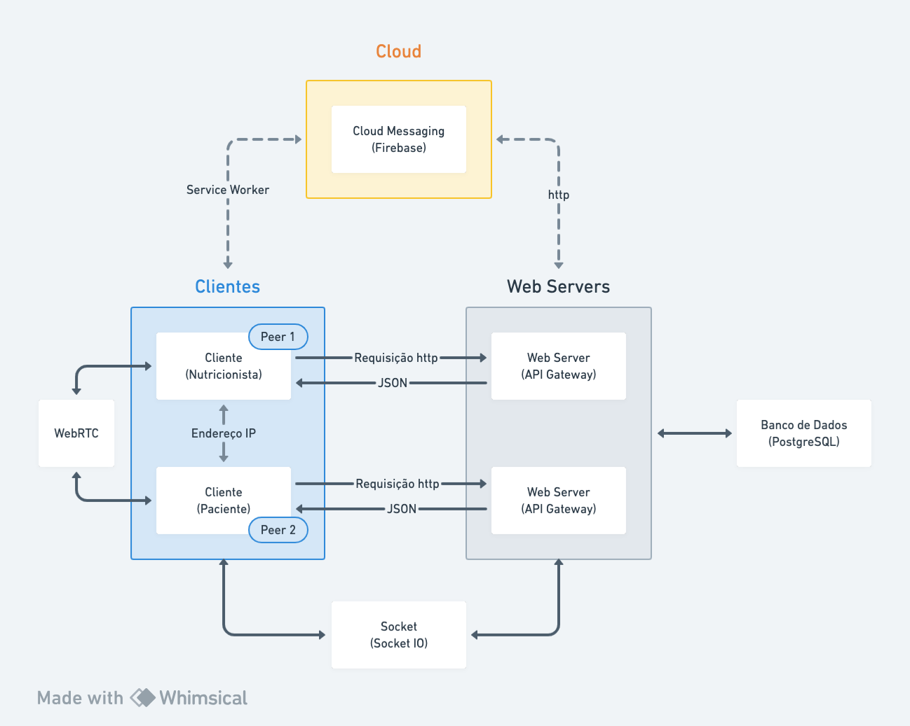

  <h1>NutriDiet</h1>

  
  
  
  

----

## Sumário
- [ Descrição do projeto ](#description)
- [ Arquitetura do sistema ](#system-architecture)
- [ Interface de serviço ](#-service-interface-)
- [ Executando a aplicação ](#-how-to-run-)
- [ Estrutura de pastas ](#-client-directory-explained-)
- [ Dependências do projeto ](#-project-dependencies-)
- [ Perguntas e respostas ](#-qa-)
- [ Documentação ](#-useful-documentation-)
- [ Licensa ](#license)

## Descrição do projeto 
**NutriDiet** é uma aplicação que permite que um paciente e um nutricionista possam se comunicar de forma mais eficiente, onde o paciente pode fornecer dados sobre suas preferências alimentares e o nutricionista pode fornecer uma dieta personalizada para o paciente.

Essa comunicação ocorre por meio de videochamadas, onde o nutricionista pode fazer uma consulta com o paciente e o paciente pode tirar dúvidas com o nutricionista.

A visão do cardápio é feita instantâneamente para ambos e pode ser baixado no dispositivo por meio de um QR Code.

O objetivo desse projeto é, além de facilitar a comunicação entre nutricionista e paciente, aprender sobre os desafios de um sistema distribuído, envolvendo `concorrência`, `consistência`, `disponibilidade` e outros.

## Arquitetura do sistema 
O sistema é composto por `cliente`, `servidor`, `banco de dados`, `servidor em nuvem` e `serviço de videochamada`.
- Cliente: Será criado a partir do framework `NextJS` na versão 13, onde será responsável pela interface do usuário e requisições ao servidor. Tal interface lidará com rotas dinâmicas, onde o usuário poderá acessar a página de login, cadastro, perfil, cardápio, etc. Ainda, conterá a visualização do cardápio, onde o usuário poderá baixar o cardápio em PDF por meio de um QR Code. Essa mesma tela conterá a vídeochamada entre os envolvidos. O detalhamento sobre essas funcionalidades podem ser vistas na sessão `Interface de serviço`. O cliente se comunucará com o servidor em núvem por meio de um *service worker* e com demais serviços por meio de requisições HTTP. A obtenção de dados em tempo real será feita por meio de `websockets` e a vídeo chamada será feita por meio de `webRTC`.
- Servidor: Será feito em `NodeJS` com a utilização do framework `NestJS`. Seu funcionamento ocorre através de rotas que acessam arquivos de serviço, que por sua vez acessam o banco de dados. O servidor se comunica com o banco de dados por meio de `ORM` e com demais serviços por meio de requisições HTTP. A obtenção de dados em tempo real será feita por meio de `websockets`.
- Banco de dados: Será feito em `PostgreSQL` e será acessado por meio de `ORM`.
- Servidor em nuvem: Será utilizado o serviço de notificações `Cloud Messaging` do `Firebase` para notificar o cliente sobre novas mensagens. Esse servidor pode ser acessado pelo cliente através do *Service Worker* e pelo servidor internamente por requisições http.
- Serviço de videochamada: Será utilizado o protocolo `WebRTC` para a comunicação entre os envolvidos.

